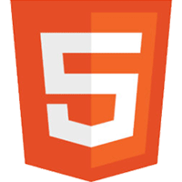
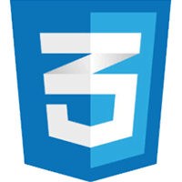
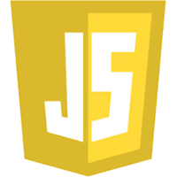
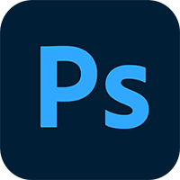
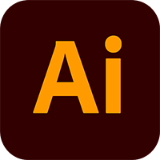

# 황혜영의 포트폴리오  
## 개발 환경  
- OS
    - Windows
    - MAC
- Tools
    - PhotoShop
    - Illustrator
    - Visual Studio Code
    - Atom  
 
---
 

## 프로젝트  
저의 `프로젝트`를 소개합니다.  

    
    
    
    

## 도구들  
제가 사용하는 `Tools`은 다음과 같습니다.  
 

  

  

 

 

## 연락처
wangheng@nate.com

